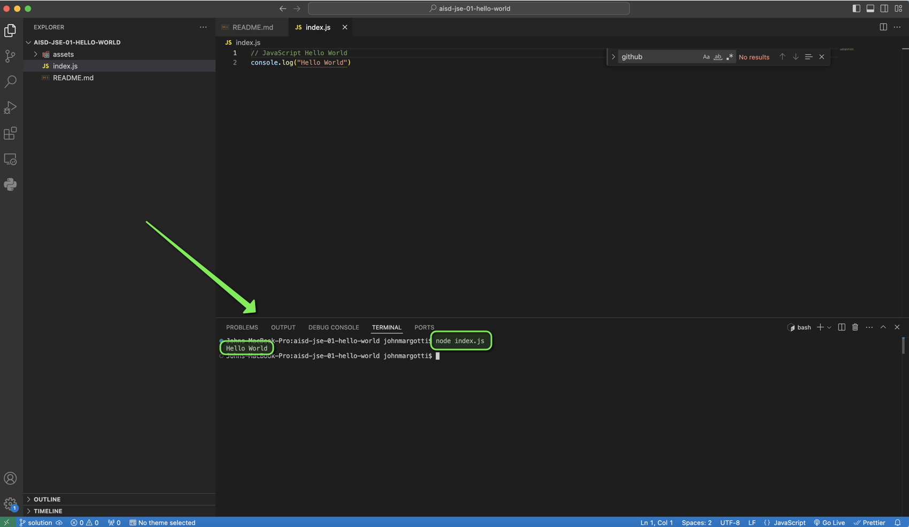

# JavaScript "Hello World"

##

## Description 📄
Welcome to JavaScript! Today, we'll make sure JavaScript is working smoothly on your computer by running it locally using Node.js. You’ll start by creating a new directory for your project, then create a simple JavaScript file named index.js with a line of code that prints "Hello, World!" to the console using console.log. We’ll also verify that you have the correct version of Node.js installed by checking with node -v. Finally, you'll run your JavaScript file using the command node index.js to see your code in action. This will ensure everything is set up correctly so you can confidently start coding in JavaScript!


## Expected Project Structure 🏗️

```plaintext
javascript-hello-world/
│
└── index.js
```

# Instructions ✅

## 1. **Create the Project Folder and Files**
   - [ ] Create a folder named `javascript-hello-world/` to store all your project files.
   
   - [ ] Inside the `javascript-hello-world/` folder, create a file named `index.js`. This will be your JavaScript file.
   

## 2. **Let's Test Our Working Environment***
Let's test if Node.js is installed and ensure the correct version is installed. 

  - [ ] Launch Visual Studio Code, then click on `File` > `Open Folder`, and select the folder you created for your project.
  - [ ] From the top menu in VS Code, click on `Terminal` and then select `New Terminal` to open a terminal window.
  - [ ] In the terminal, type `node -v` and press Enter. You should see a version number returned, which you can verify as the correct version.

```bash
node -v 
```

**Explanation:**
- These steps help you verify that Node.js is installed on your machine and ensure you have the correct version needed to run JavaScript code locally.

## 3. **Let's Write Some JavaScript Code**
Now that you have your files set up, let's write some JavaScript.

  - [ ] Open your currently empty `index.js` file and add the following code:

```javascript
console.log("Hello World")
```

**Explanation:**
- By adding this code, you created a simple JavaScript command that prints "Hello, World!" to the console, allowing you to check that your JavaScript is running properly.

##

## 4. **Run Your JavaScript Code in the Terminal**
Now that you've written your JavaScript code, let's run it in the terminal to see the output.

  - [ ] In Visual Studio Code, make sure you have the terminal open. If not, go to the top menu, click `Terminal`, then select `New Terminal`.
  - [ ] To run your JavaScript code, type the following command and press Enter:
  
```bash
node index.js
```
 - [ ] Look at the terminal output. You should see the text "Hello, World" printed. 

**Explanation:**
By running node index.js in the terminal, you executed your JavaScript code and confirmed it works by seeing "Hello, World" printed in the terminal output. If so, congratulations—your JavaScript is running successfully!

## 5. **Log Another Message to the Console**
Let's try logging something different to see how easy it is to modify and run your code.

- [ ] Open your `index.js` file again and update the code as seen below.

```javascript
console.log("Learning JavaScript is fun!");
```
  - [ ] Now, run your JavaScript code again in the terminal by typing the following command and pressing Enter:
  
```bash
node index.js
```

**Explanation:**
By updating the console.log message and running node index.js again, you tested your ability to modify and execute JavaScript code to see different outputs in the terminal.

## 6. **Commit and Push to Github**
 - [ ] Commit and push your work to Github.

# Conclusion 📄
In this assignment, you successfully wrote and ran your first JavaScript code using Node.js. You started with a simple command to print "Hello, World!" and then experimented by changing the message to see how easy it is to modify and run JavaScript code. By following these steps, you gained hands-on experience with running JavaScript in the terminal, reinforcing your understanding of basic coding and output in JavaScript. Great work, and keep exploring the possibilities with JavaScript!

##

### Solution codebase 👀
🛑 **Only use this as a reference** 🛑

💾 **Not something to copy and paste** 💾

**Note:**  This lab references a solution file located [here](https://github.com/HackerUSA-CE/aisd-wde-4-the-box-model/tree/solution) (link not shown).


---
© All rights reserved to ThriveDX
